<h1 align="center">📱 JKLU Eezy – Unified Digital Campus App</h1>

<p align="center">
  
  &nbsp;
  
  &nbsp;
  
  &nbsp;
  
  &nbsp;
  
  &nbsp;
  
</p>

---

## 🚀 About JKLU Eezy  
**JKLU Eezy** is a cross-platform mobile application designed to simplify and digitalize the campus experience for students and faculty of **JK Lakshmipat University (JKLU)**.

As highlighted in the project report, the app provides a **unified platform for class timetables, mess menu, announcements, study materials, emergency contacts, lost & found, and more**—eliminating the need to navigate multiple scattered sources.

Built using **Flutter (frontend)** and **Node.js + MongoDB (backend)**, JKLU Eezy aims to create a smart, connected, and efficient digital ecosystem across the university.

---

## 🎯 Key Objectives  
Based on the project documentation: :contentReference[oaicite:2]{index=2}

- Centralize all essential campus services into one mobile application  
- Enhance communication between students, faculty, and administration  
- Provide real-time updates for announcements, mess menu, and timetables  
- Improve convenience, accessibility, and user engagement  
- Support JKLU’s long-term goal of a Smart Digital Campus  

---

## 🏗️ System Overview  
According to the system architecture in the report: :contentReference[oaicite:3]{index=3}

- **Frontend:** Flutter (Dart) for cross-platform smooth UI  
- **Backend:** Node.js + Express.js  
- **Database:** MongoDB  
- **Authentication:** University email login  
- **Modular design:** Supports multiple integrated modules  
- **Scalable:** Future enhancements like attendance, bus tracking, notifications  

---

## 🎉 Features  
Based on detailed module descriptions: :contentReference[oaicite:4]{index=4}

### 🔹 Contact Directory  
Find faculty, staff, admin, and emergency contacts instantly.

### 🔹 Announcements  
Real-time university updates, events, exam notices.

### 🔹 Mess Management  
Daily/weekly mess menu with clean UI.

### 🔹 Study Materials  
Lecture notes, PDFs, assignments – all at one place.

### 🔹 Lost & Found  
Report or retrieve lost items easily.

### 🔹 Class Timetable  
Full weekly schedule with year & stream selection.

### 🔹 Bus Routes  
Bus timings, pickup points, and route information.

### 🔹 Laundry Status  
Check laundry pickup/delivery status.

### 🔹 Complaints Module  
Submit and track hostel, mess, academic, and maintenance complaints.

### 🔹 Quick Actions  
Instant access to emergency contacts.

---

## 📸 App Screenshots

<table align="center">
  <tr>
    <td>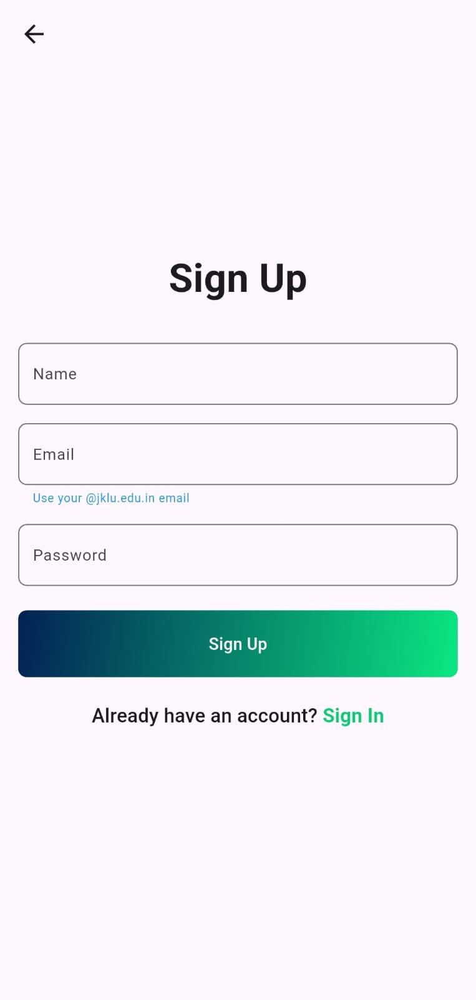</td>
    <td>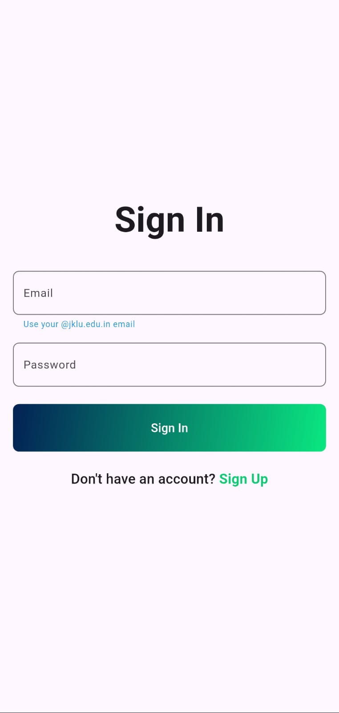</td>
    <td>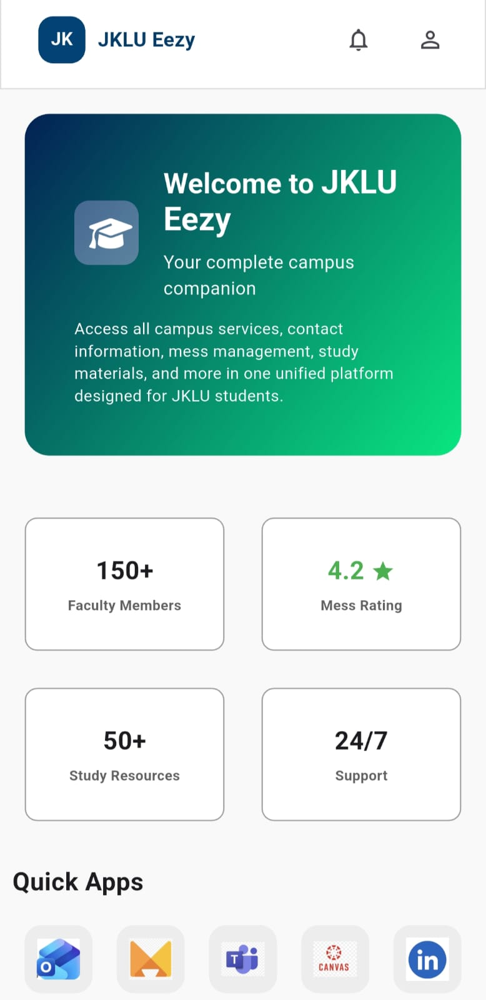</td>
  </tr>
  <tr>
    <td>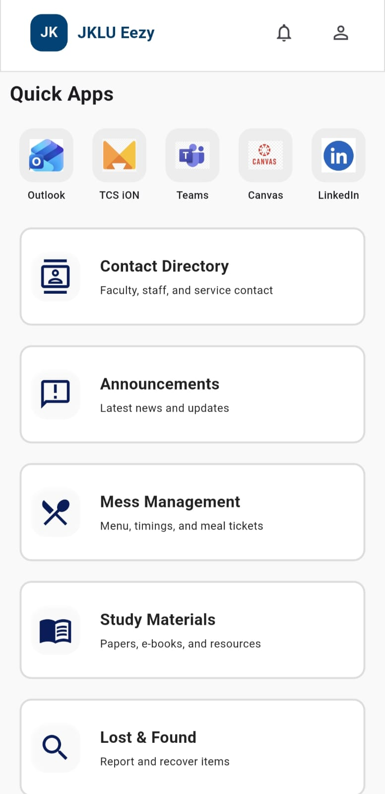</td>
    <td>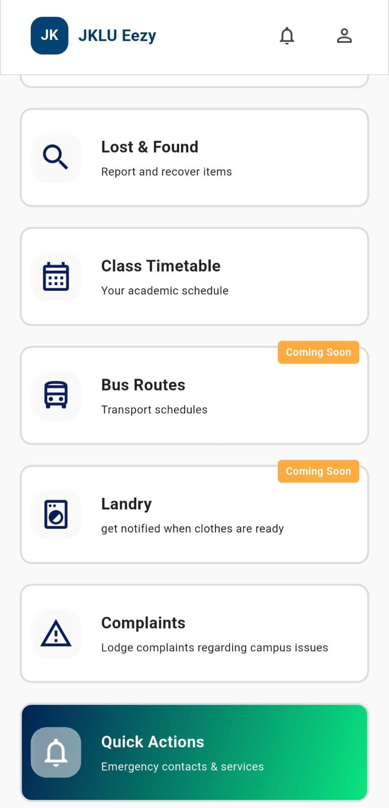</td>
    <td>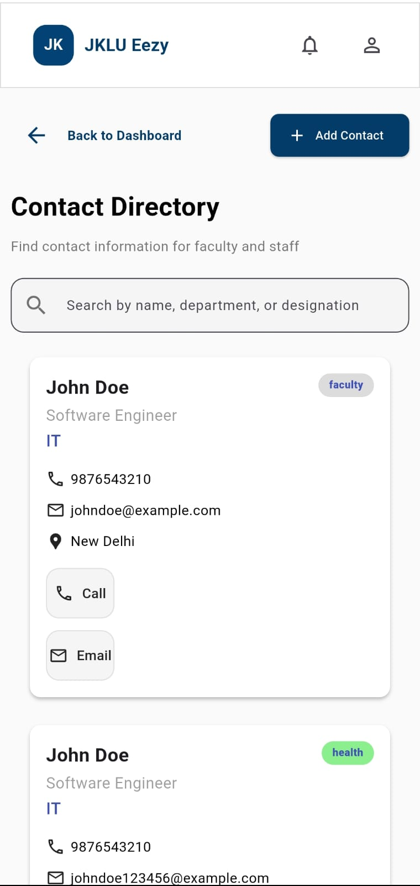</td>
  </tr>
  <tr>
    <td>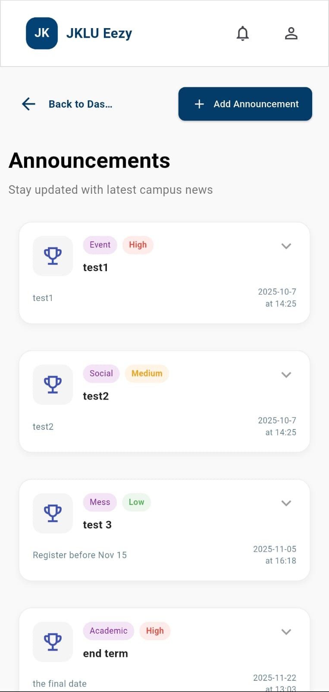</td>
    <td>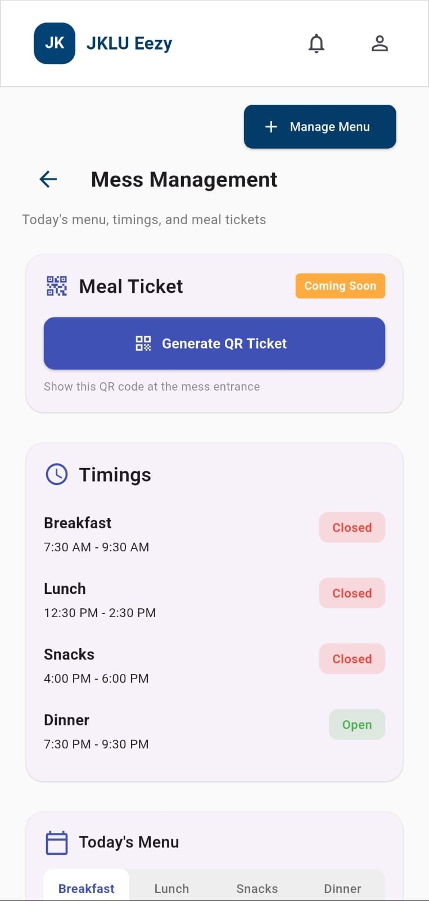</td>
    <td>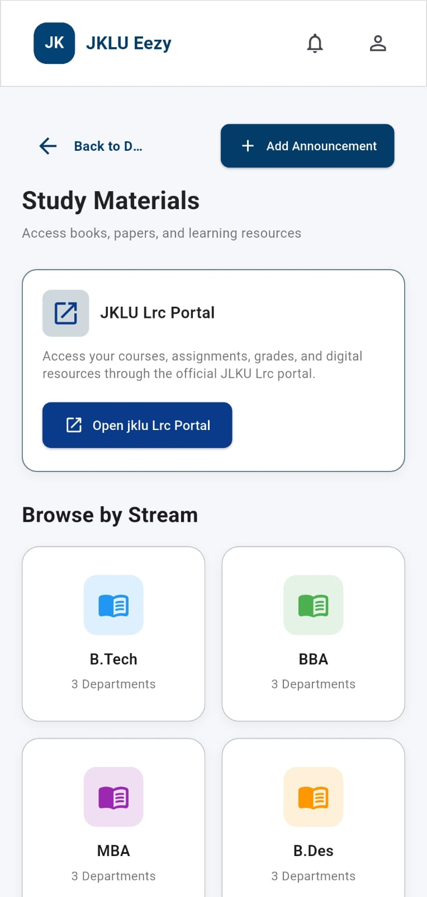</td>
  </tr>
  <tr>
    <td>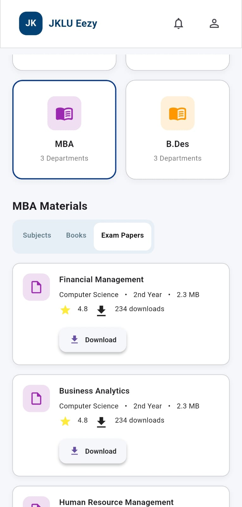</td>
    <td>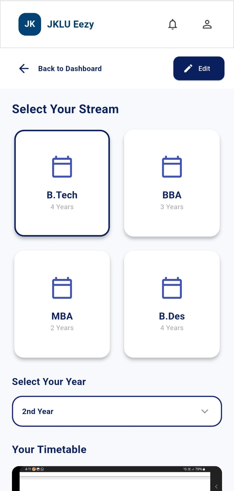</td>
    <td>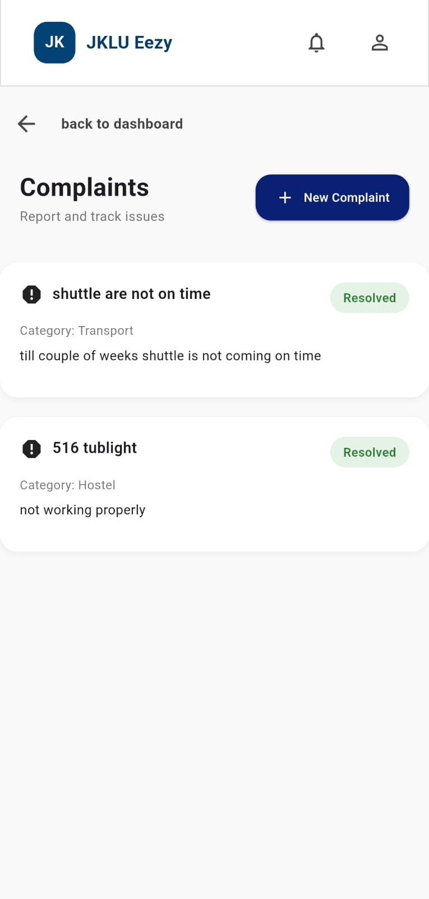</td>
  </tr>
  <tr>
    <td>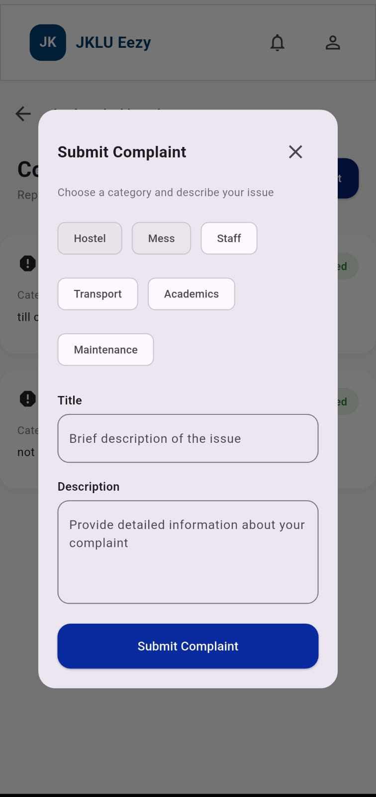</td>
    <td>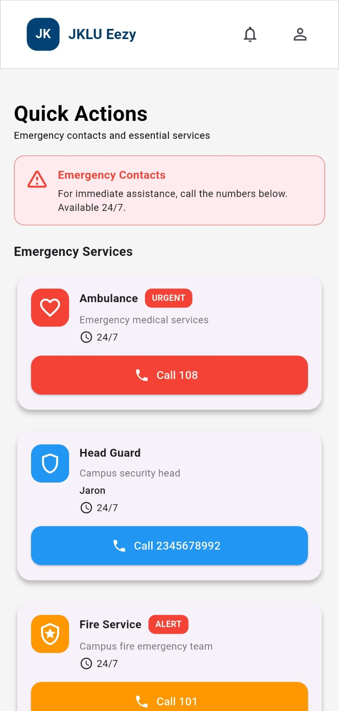</td>
  </tr>
</table>

---

Backend repo is **not inside this folder**.  
Clone backend separately (instructions below).

---

# 🛠️ Installation & Setup Guide  

## 1️⃣ Clone This Frontend Repository

```bash
git clone https://github.com/kushal-sangavat/jklu_eezy.git
cd jklu_eezy
npm install
flutter pub get
```

## 2️⃣ Add .env File (Required)
```
# Development backend URLs
BACKEND_URL=
ANDROID_BACKEND_URL=
IOS_BACKEND_URL=
```

➡️ Fill these values with your backend deployed URL or localhost links.

## 3️⃣ 🗄️ Backend Setup (Required)

The backend is in a separate GitHub repository named:

✔ server_jklu_eezy

Clone backend separately:
```
git clone https://github.com/kushal-sangavat/server_jklu_eezy.git
cd server_jklu_eezy
npm install
```
## 4️⃣🔧 Backend .env Example

Create this inside backend folder:
```
MONGO_URI=
JWT_SECRET=
CLOUDINARY_KEY=
CLOUDINARY_SECRET=
```
### Run Backend in Development:
```
npm run dev
```
### Run Backend in Production:
```
npm start

```

